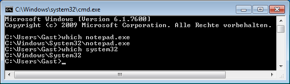

# which for Windows

## Description

The following Windows batch file is a natively developed solution of the well
known terminal command `which` from the Unix/Linux operating system. It returns
the absolute path of a given file as argument, if it is present within the path
environment variable.

## Setup

Just save the code to a BAT or a CMD file respectively, somewhere within your
path environment variable on your computer (e.g. `%WINDIR%`).

## Usage

Pass the name of a file as argument to the script and it returns the absolute
path of the given object, as long as it is present within the path environment
variable. By the way, you can also use it to find non executables as well.

## Screenshot

## Related Resources

* [which (Unix)](http://en.wikipedia.org/wiki/Which_(Unix))
* [Batch file](http://en.wikipedia.org/wiki/Batch_file)
